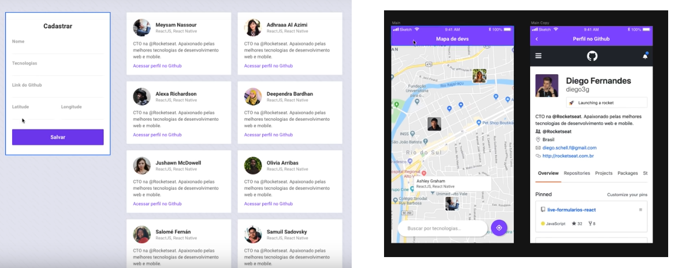

<h4 align="center">
  ☕ Code and coffee+coffee and knowledge
</h4>

  

  
  
  

   

  

  <a href="#rocket-tecnologias">Tecnologias</a>&nbsp;&nbsp;&nbsp;|&nbsp;&nbsp;&nbsp;
  <a href="#-projeto">Projeto</a>&nbsp;&nbsp;&nbsp;|&nbsp;&nbsp;&nbsp;  
  <a href="#memo-licença">Licença</a>

 

  

## :rocket: Tecnologias

Esse projeto foi desenvolvido com as seguintes tecnologias:

- [Node.js](https://nodejs.org/en/)
- [React](https://reactjs.org)
- [React Native](https://facebook.github.io/react-native/)
- [Expo](https://expo.io/)

## 💻 Projeto

O DevRadar é um projeto que visa encotrar devs que trabalhem em uma tecnologia em especifico ou um conjunto, seja pra montar um time para um projeto ou para criação de uma startup, ou para tomar uma cervejas e trocar ideias. :)

>Esse projeto foi feito no Windows, depois irei fazer outro no Linux para aplicar os conhecimentos adquiridos nessa semana.

## :memo: Licença

Esse projeto está sob a licença MIT. Veja o arquivo [LICENSE](LICENSE.md) para mais detalhes.

---

Projeito da Rocketseat :wave: #SemanaOmnistack 10. 
